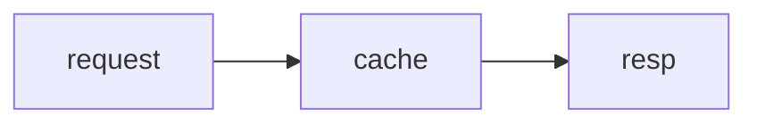

# epistemic-ink

Two Claude Code output styles and a mod that draws the figures they write.

- **Styles** — *Epistemic Ink* and *Proactive Epistemic Ink*, picked as the
  session's output style. They format replies with Ink's phase headers, gates and
  insights, and decide when a reply needs a picture at all.
- **Figure mod** — draws, in the terminal transcript, the figures a reply cannot
  write as text, right where the fence was.

## How the two work together

When the style judges that the reader's task is taking in relations at once — a
graph, a flow, states, a sequence, classes, entities — it writes a
` ```mermaid ` fence; for a two-dimensional formula, a ` ```math ` fence. It
keeps a picture small enough to hold (about 12 nodes, 24 at most) and never
draws box art by hand. The mod then draws the fence:

| Fence | Drawn as | What it is for |
|---|---|---|
| ` ```mermaid ` flowchart/graph, sequence, class, state, ER | box art | a computed diagram layout |
| ` ```mermaid ` xychart with a `line` series | an axis chart | a trend a sparkline cannot carry |
| ` ```math ` (TeX) | an image | 2-D structure: fractions, matrices, stacked scripts |

Everything text can write stays text: bar charts, tables and shaded matrices
(block characters, a stated scale, the harness's table columns), and flat
expressions such as `a + b = c` or `O(n log n)`. Every other mermaid kind keeps
its fence.

One `ui.render` hook on `AssistantMessage` reads every fence in one pass, so a
reply holding several figures draws whole.

The mod needs Claude Code v2.1.287 or later (mods on by default) and the
interactive terminal. On any other surface, and for a fence that does not
parse, is not a drawn kind, holds a statement outside the drawn grammar or is
wider than the terminal, the fence is left as written. The Desktop app draws ` ```math `
itself and shows other fences as code.

Where the fence is not drawn, it shows as written — the mermaid or TeX source,
readable as it is; the styles accept that rather than fall back to hand-drawn
art. The mod draws such fences under any output style, not only these two.

## Install

```bash
claude plugin marketplace add jongwony/cc-plugin
claude plugin install epistemic-ink@cc-plugin
```

Then `/reload-plugins` in a running session.

## Diagrams

Standard mermaid source, within the grammar below. A top-down flowchart or state
diagram (a flowchart header with no direction is top-down, as in mermaid) is laid
out left to right when no word of the drawing is lost and it fits the terminal or
is no wider than the top-down layout; a flowchart written `BT` or `LR` keeps its
direction. Spacing is compact: three columns and one row between boxes, one cell
inside them.

### Drawn grammar

The renderer reads more of mermaid than it draws faithfully, so a fence is drawn
only when every statement is one of these forms; any other statement leaves the
whole fence as written. Each form has a test showing its drawing keeps its
labels, arrows and direction, and the drawing must still show every label whole.

| Kind | Drawn forms |
|---|---|
| flowchart | header `LR`, `TD`, `TB`, `BT` or none; nodes `A`, `A[text]`, `A(text)`, `A{text}` (text quoted or not); one `A --> B` per line, optionally `-->\|word\|`; one edge per pair of nodes; `style`, `classDef`, `class`, `click`, `linkStyle`, `accTitle:`, `accDescr:` |
| state | `direction LR` or `TB`; `A --> B` between states or `[*]`, optionally `: text`; `state "text" as A`; `A : text`; one transition per pair of states |
| sequence | `participant A`, `participant A as text`; `A->>B: text`, `A-->>B: text`, a self-message included |
| class | `class A`, `class A { … }`, `A : member`: `Type name`, `name`, `name()`, `name() Type`, each with an optional `+ - # ~`, a name once per class; `<\|--`, `*--`, `o--`, `-->`, `..>`, `..\|>`, optionally `: text`, as chains (no class above two others or below two, no cycle) |
| ER | `A ‹card›--‹card› B : label` (`--` or `..`); `A { type name … }`; each entity in at most one relationship |
| xychart | upright `xychart`/`xychart-beta`; `title "text"`; `x-axis [a, b, …]`; `y-axis min --> max` in integers; one `line [ … ]` of integers |

A diagram that would stay top to bottom (a `BT` flowchart, a top-down one the
sideways layout does not take, a state diagram with `direction TB`) is drawn only
as one unlabelled chain: at one row between boxes a label or a branch draws over
the box borders.

Outside the grammar, among others: subgraphs, composite states and every edge to
them; `graph RL`; other edge shapes, chained edges and `&`; an edge label with a
space; notes; sequence blocks (`alt`, `opt`, `loop`, …), activations, `actor`,
`autonumber`, `<br/>` and arrows other than `->>`/`-->>`; class methods with
parameters, overloads, undirected relations, multiplicities, generics,
annotations, namespaces and fan-outs; ER aliases, attribute keys and comments; a
chart's axis titles, fractional values, bars, second series and `horizontal`; and
a drawing whose title or category names would be cut or run together.

````markdown

````

```text
┌─────────┐   ┌───────┐   ┌──────┐
│         │   │       │   │      │
│ request ├──►│ cache ├──►│ resp │
│         │   │       │   │      │
└─────────┘   └───────┘   └──────┘
```

Labels are measured in screen cells, so Hangul and other double-width labels line
up inside the boxes. The drawing here uses ASCII labels because a web page's
monospace font does not give a Hangul character exactly two columns; in the
terminal, where it does, Hangul labels such as `서울 요청` line up the same way.

Borders and junctions are drawn cyan, arrows yellow, lines dim, through element
styles.

## Line charts

A mermaid `xychart` (or `xychart-beta`) that holds one `line` series of integers
is drawn on a y-axis with ticks and grid dots, its categories under the x-axis,
the line in magenta. A value off its y-axis, or a series with more or fewer values
than the categories, keeps its fence.

````markdown
```mermaid
xychart-beta
  title "Latency"
  x-axis [mon, tue, wed, thu, fri]
  y-axis 0 --> 120
  line [20, 35, 80, 60, 110]
```
````

The line is drawn as steps between the categories, on a plot at least 60
columns wide and 20 rows tall.

## Math

A ` ```math ` fence holds TeX (the `base` and `ams` packages) and is drawn as an
image. Use it only where the structure is two-dimensional — a fraction, a matrix,
a sum with stacked limits; a flat expression stays in the text.

````markdown
```math
\frac{a+b}{c} = \sqrt{x^2 + y^2}
```
````

- The image is sized against an assumed terminal cell of 9 × 18 pixels at
  16 pixels per em, since a mod cannot read the terminal's font metrics. On a
  terminal with another cell shape the formula is scaled to the same box of
  cells.
- The ink follows the Claude Code theme: dark on a `light*` theme, light on a
  `dark*` theme. With `auto`, which follows the terminal, the ink is a middle
  grey that reads on either.
- Claude Code draws the pixels where the terminal can (kitty, Ghostty); elsewhere
  the TeX source shows, dim, in its place.
- Frames (`\boxed`) and array rules (`|`, `\hline`) are drawn as lines.
  Malformed TeX, an unknown macro, a dashed rule, `\text` holding a character
  the math font lacks (Hangul, for one; Latin `\text{if }` draws), or a line
  break `\\` or `\newline` that MathJax draws as a space (anywhere but a table
  row: `equation` included) keeps the fence, as does a formula wider than the
  terminal, one drawn with a colour, a background, hidden parts or a stroked
  outline, any `\pmb` (each nesting doubles the work), any
  `\DeclareMathOperator` (a chain of operators built from earlier ones grows the
  same way; `\operatorname` draws), or any `alignat` or `alignedat` (its
  column count is allocated as written; `aligned` draws).
  Each fence is read on its own: an operator one fence declares does not
  reach the next. A single `$$…$$` or `\[…\]` wrapper around the whole fence is
  ignored; a fence holding two display formulas keeps its fence.

## Limits

- A diagram or chart wider than the terminal keeps its fence, as a formula
  does; it is drawn again when the terminal is widened enough to hold it.
- A diagram past its size caps keeps its fence rather than holding the
  transcript while it is laid out: 60 nodes or 100 edges for a flowchart or
  state diagram; 20 participants or 150 messages for a sequence diagram; 40
  classes or entities, 80 relationships or 400 members or attributes for a class
  or ER diagram; 120 values for a chart. So
  does one whose drawing would need a canvas over 250,000 cells (a label
  thousands of characters long between many boxes), and one with an edge the
  router gives up on, rather than drawing it as a straight line through the
  boxes between.
- `AssistantMessage` is the finest site a mod can draw in, so a reply holding a
  figure is redrawn as Markdown pieces around it. A piece over 10,000
  characters, or one carrying escape codes another mod wrote into the reply,
  makes the whole reply fall back to Claude Code's own drawing, and so does a
  link reference or footnote definition (`[1]: …`, its destination on the same
  line or the next), which the pieces would lose.
- A fence counts as a figure when it is indented at most three spaces, as in
  CommonMark; one indented four is an indented code block and stays text. A
  fence inside a list item is drawn, and the text after it in that item follows
  as its own paragraph. A fence opened on a list item's or a block quote's own
  marker line (`- ~~~`, `` > ``` ``) is not drawn, and every fence inside it is its
  text.
- A mermaid fence the renderer does not read whole keeps its source rather than
  drawing the rest: a Hangul flowchart or state ID (a Hangul label is fine), two
  statements on one line, or a class or entity left open at the end.
- A label holding a combining mark, a joined emoji sequence, a flag, a
  skin-tone modifier, a one-cell character outside the Basic Multilingual
  Plane (`𝐀`, `🌡`) or a control character such as a tab keeps its fence: the
  terminal draws those in another number of cells than the layout can count.

## Renderers

- Diagrams and charts: [beautiful-mermaid](https://github.com/lukilabs/beautiful-mermaid)
  1.1.3 (MIT, `hooks/vendor/LICENSE`), bundled into `hooks/vendor/mermaid-ascii.js`
  with the patches in `scripts/patches.mjs`:
  - a bounded edge search, a work budget across a drawing's searches, and a
    node and edge count past which a flowchart is not laid out;
  - an edge's start junction placed on its box border — at tight spacing it
    landed inside the box, and a diamond's edge started a few cells away from it;
  - every statement read or the parse refused, so a fence is never drawn in part;
  - a node's or state's later text kept, as mermaid keeps it;
  - an ER relationship gap as wide as its label;
  - a routing row at least one cell tall, so a self-loop keeps its return;
  - a chart's bars grown from the axis end nearest zero when zero lies off the
    axis.

  The kind table, the left-to-right flip and the role colouring are adapted from
  [claude-mermaid](https://github.com/galElmalah/claude-mods) (Gal Elmalah, MIT,
  `hooks/vendor/LICENSE-claude-mermaid`).
- Math: [MathJax](https://www.mathjax.org/) 3.2.2 (Apache-2.0,
  `hooks/vendor/LICENSE-mathjax`) turns TeX into SVG outlines, bundled into
  `hooks/vendor/math/`; `hooks/math.ts` fills the outlines into pixels. The mod
  runtime has no WebAssembly and no `eval`, and reads no module file over
  1 MiB, so the bundle is split into chunks under that size.

## Build and test

`hooks/vendor/mermaid-ascii.js` and `hooks/vendor/math/*.js` are generated;
rebuild them after changing `scripts/patches.mjs`, `scripts/math-entry.mjs` or a
pinned renderer version (Node 22+). The build fails when a patch's anchor or
target file has moved upstream, or a file would exceed 1 MiB.

```bash
cd epistemic-ink && npm install && npm run build:vendor
claude plugin test
```
