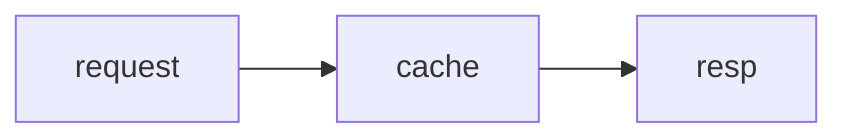

# ink-figure

A Claude Code mod that draws ` ```mermaid ` fences in Claude's replies — flowchart,
sequence, class, state and ER diagrams — as box art right where the fence was, in
the terminal transcript.

It draws only what cannot be written as transcript text: a computed diagram
layout. Bars and tables are written as text, and so are shaded matrices.

One `ui.render` hook on `AssistantMessage` reads every mermaid fence in one pass,
so a reply holding several draws whole.

Labels are measured in screen cells, so Hangul and other double-width labels line
up inside the boxes.

Needs Claude Code v2.1.287 or later (mods on by default) and the interactive
terminal. On any other surface, and for a fence that does not parse or is not a
drawn kind, the fence is left as written.
The Desktop app draws ` ```math ` itself and shows other fences as code.

## Install

```bash
claude plugin marketplace add jongwony/cc-plugin
claude plugin install ink-figure@cc-plugin
```

Then `/reload-plugins` in a running session.

## Fence syntax

Standard mermaid source. Drawn kinds: `flowchart`/`graph`, `sequenceDiagram`,
`classDiagram`, `stateDiagram`, `erDiagram`; any other kind, `xychart` among
them, keeps its fence. A top-down flowchart or state diagram is laid out left to right when no
label is lost and it fits. Spacing is compact: three columns and one row between
boxes, one cell inside them.

````markdown

````

```text
┌─────────┐   ┌───────┐   ┌──────┐
│         │   │       │   │      │
│ request ├──►│ cache ├──►│ resp │
│         │   │       │   │      │
└─────────┘   └───────┘   └──────┘
```

The drawings here use ASCII labels because a web page's monospace font does not
give a Hangul character exactly two columns; in the terminal, where it does,
Hangul labels such as `서울 요청` line up the same way.

Borders and junctions are drawn cyan, arrows yellow, lines dim, through element
styles.

The renderer is [beautiful-mermaid](https://github.com/lukilabs/beautiful-mermaid)
(MIT, `hooks/vendor/LICENSE`), bundled into `hooks/vendor/mermaid-ascii.js` with
the patches in `scripts/patches.mjs`: a bounded edge search, and an edge's start
junction placed on its box border — at tight spacing it landed inside the box,
and a diamond's edge started a few cells away from it. Fence detection, the
left-to-right flip and the role colouring are adapted from
[claude-mermaid](https://github.com/galElmalah/claude-mods) (Gal Elmalah, MIT).

## Limits

- A diagram wider than the terminal is cut with a `… N columns cut` line.
- `AssistantMessage` is the finest site a mod can draw in, so a reply holding a
  diagram is redrawn as Markdown pieces around it. A piece over 10,000
  characters, or one carrying escape codes another mod wrote into the reply,
  makes the whole reply fall back to Claude Code's own drawing.
- A node ID must be ASCII (a Hangul label is fine, a Hangul ID is not
  parsed upstream); such a fence keeps its source.

## Build and test

`hooks/vendor/mermaid-ascii.js` is generated; rebuild it after changing
`scripts/patches.mjs` or the pinned renderer version (Node 22+):

```bash
cd ink-figure && npm install && npm run build:vendor
claude plugin test
```
