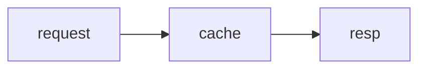

# ink-figure

A Claude Code mod that draws, in the terminal transcript, the figures Claude's
replies cannot write as text — right where the fence was:

| Fence | Drawn as | What it is for |
|---|---|---|
| ` ```mermaid ` flowchart/graph, sequence, class, state, ER | box art | a computed diagram layout |
| ` ```mermaid ` xychart with a `line` series | an axis chart | a trend a sparkline cannot carry |
| ` ```math ` (TeX) | an image | 2-D structure: fractions, matrices, stacked scripts |

Everything text can write stays text: bar charts, tables and shaded matrices
(block characters, a stated scale, the harness's table columns), and flat
expressions such as `a + b = c` or `O(n log n)`. A bar-only xychart, and every
other mermaid kind, keeps its fence.

One `ui.render` hook on `AssistantMessage` reads every fence in one pass, so a
reply holding several figures draws whole.

Needs Claude Code v2.1.287 or later (mods on by default) and the interactive
terminal. On any other surface, and for a fence that does not parse or is not a
drawn kind, the fence is left as written. The Desktop app draws ` ```math `
itself and shows other fences as code.

## Install

```bash
claude plugin marketplace add jongwony/cc-plugin
claude plugin install ink-figure@cc-plugin
```

Then `/reload-plugins` in a running session.

## Diagrams

Standard mermaid source. A top-down flowchart or state diagram is laid out left
to right when no label is lost and it fits. Spacing is compact: three columns
and one row between boxes, one cell inside them.

````markdown

````

```text
┌─────────┐   ┌───────┐   ┌──────┐
│         │   │       │   │      │
│ request ├──►│ cache ├──►│ resp │
│         │   │       │   │      │
└─────────┘   └───────┘   └──────┘
```

Labels are measured in screen cells, so Hangul and other double-width labels line
up inside the boxes. The drawing here uses ASCII labels because a web page's
monospace font does not give a Hangul character exactly two columns; in the
terminal, where it does, Hangul labels such as `서울 요청` line up the same way.

Borders and junctions are drawn cyan, arrows yellow, lines dim, through element
styles.

## Line charts

A mermaid `xychart` (or `xychart-beta`) that holds at least one `line` series is
drawn on a y-axis with ticks and grid dots, its categories under the x-axis. Bars
in the same chart are drawn beside the line. The first series takes magenta, and
later series green, blue and red, in the legend's order — colours that read on a
light theme and a dark one alike. A chart with more series than that, or a value
off its y-axis, keeps its fence.

````markdown
```mermaid
xychart-beta
  title "Latency"
  x-axis [mon, tue, wed, thu, fri]
  y-axis "ms" 0 --> 120
  line [20, 35, 80, 60, 110]
```
````

The line is drawn as steps between the categories, on a plot at least 60
columns wide and 20 rows tall.

## Math

A ` ```math ` fence holds TeX (the `base` and `ams` packages) and is drawn as an
image. Use it only where the structure is two-dimensional — a fraction, a matrix,
a sum with stacked limits; a flat expression stays in the text.

````markdown
```math
\frac{a+b}{c} = \sqrt{x^2 + y^2}
```
````

- The image is sized against an assumed terminal cell of 9 × 18 pixels at
  16 pixels per em, since a mod cannot read the terminal's font metrics. On a
  terminal with another cell shape the formula is scaled to the same box of
  cells.
- The ink follows the Claude Code theme: dark on a `light*` theme, light on a
  `dark*` theme. With `auto`, which follows the terminal, the ink is a middle
  grey that reads on either.
- Claude Code draws the pixels where the terminal can (kitty, Ghostty); elsewhere
  the TeX source shows, dim, in its place.
- Frames (`\boxed`) and array rules (`|`, `\hline`) are drawn as lines.
  Malformed TeX, an unknown macro, `\text`, or a dashed rule keeps the fence, as
  does a formula wider than the terminal. A `$$…$$` or `\[…\]` wrapper inside the
  fence is ignored.

## Limits

- A diagram or chart wider than the terminal is cut with a `… N columns cut`
  line.
- `AssistantMessage` is the finest site a mod can draw in, so a reply holding a
  figure is redrawn as Markdown pieces around it. A piece over 10,000
  characters, or one carrying escape codes another mod wrote into the reply,
  makes the whole reply fall back to Claude Code's own drawing, and so does a
  link reference or footnote definition (`[1]: …`), which the pieces would lose.
- A fence counts as a figure when it is indented at most three spaces, as in
  CommonMark; one indented four is an indented code block and stays text. A
  fence inside a list item is drawn, and the text after it in that item follows
  as its own paragraph.
- A mermaid fence holding a statement the renderer does not read keeps its
  source whole rather than drawing the rest: a Hangul node ID (a Hangul label is
  fine), two statements on one line, a note, `autonumber`, a sequence `title`,
  a sequence activation (`activate`, `->>+`), a bare state or entity name, an
  unquoted chart title or a non-numeric value.
- A label holding a combining mark, a joined emoji sequence, a flag, a
  skin-tone modifier or a one-cell character outside the Basic Multilingual
  Plane (`𝐀`, `🌡`) keeps its fence: the terminal draws those in fewer cells than
  the layout can count.

## Renderers

- Diagrams and charts: [beautiful-mermaid](https://github.com/lukilabs/beautiful-mermaid)
  1.1.3 (MIT, `hooks/vendor/LICENSE`), bundled into `hooks/vendor/mermaid-ascii.js`
  with the patches in `scripts/patches.mjs`:
  - a bounded edge search;
  - an edge's start junction placed on its box border — at tight spacing it
    landed inside the box, and a diamond's edge started a few cells away from it;
  - every statement read or the parse refused, so a fence is never drawn in part;
  - a node's or state's later text kept, as mermaid keeps it;
  - an ER relationship gap as wide as its label;
  - a routing row at least one cell tall, so a self-loop keeps its return.

  The kind table, the left-to-right flip and the role colouring are adapted from
  [claude-mermaid](https://github.com/galElmalah/claude-mods) (Gal Elmalah, MIT).
- Math: [MathJax](https://www.mathjax.org/) 3.2.2 (Apache-2.0,
  `hooks/vendor/LICENSE-mathjax`) turns TeX into SVG outlines, bundled into
  `hooks/vendor/math/`; `hooks/math.ts` fills the outlines into pixels. The mod
  runtime has no WebAssembly and no `eval`, and reads no module file over
  1 MiB, so the bundle is split into chunks under that size.

## Build and test

`hooks/vendor/mermaid-ascii.js` and `hooks/vendor/math/*.js` are generated;
rebuild them after changing `scripts/patches.mjs`, `scripts/math-entry.mjs` or a
pinned renderer version (Node 22+). The build fails when a patch's anchor or
target file has moved upstream, or a file would exceed 1 MiB.

```bash
cd ink-figure && npm install && npm run build:vendor
claude plugin test
```
