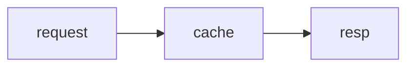

# ink-figure

A Claude Code mod that draws figure fences in Claude's replies right where the
fence was, in the terminal transcript:

- ` ```heatmap ` — a matrix of measured values, one colour shade per value band (`Raster` cells)
- ` ```mermaid ` — flowchart, sequence, class, state and ER diagrams as box art

A fence is drawn only when what it shows cannot be written as transcript text —
colour, computed layout; bars and tables are written as text.

One `ui.render` hook on `AssistantMessage` reads every fence of every kind in one
pass, so a reply that mixes kinds draws whole.

Labels are measured in screen cells, so Hangul and other double-width labels line
up — beside the `Raster` cells for heatmaps, inside the boxes for diagrams. Every
heatmap states what one shade stands for, and values fall into whole bands —
nothing finer than a band is implied.

Needs Claude Code v2.1.287 or later (mods on by default) and the interactive
terminal. On any other surface, and for a fence that does not parse, is not a
drawn kind, or does not fit the terminal width, the fence is left as written.
The Desktop app draws ` ```math ` itself and shows other fences as code.

## Install

```bash
claude plugin marketplace add jongwony/cc-plugin
claude plugin install ink-figure@cc-plugin
```

Then `/reload-plugins` in a running session.

## Fence syntax

### heatmap

A header row of column names, then one row per label ending in one value per
column, with an optional `unit:` line anywhere in the block. Separate with
spaces, or write a markdown table with `|` (a `|---|` rule line is skipped). The
header may carry a corner cell above the labels or not. `-` marks a missing
value, drawn blank.

````markdown
```heatmap
unit: ms
        00h 06h 12h
Seoul    12  40  95
Tokyo    10  33  -
```
````

Each value is two cells wide (three past nine columns), coloured on an
eight-step viridis scale. Columns are numbered above the cells and named in a
key line below, since names would not fit a two-cell column:

```text
       1 2 3
Seoul  ██████
Tokyo  ████
██████████ 1 shade ~ 20 ms · 0 to 100 ms, 5 shades · blank = no value
columns: 1 00h · 2 06h · 3 12h
```

### mermaid

Standard mermaid source. Drawn kinds: `flowchart`/`graph`, `sequenceDiagram`,
`classDiagram`, `stateDiagram`, `erDiagram`; any other kind, `xychart` among
them, keeps its fence. A top-down flowchart or state diagram is laid out left to right when no
label is lost and it fits. Spacing is compact: three columns and one row between
boxes, one cell inside them.

````markdown

````

```text
┌─────────┐   ┌───────┐   ┌──────┐
│         │   │       │   │      │
│ request ├──►│ cache ├──►│ resp │
│         │   │       │   │      │
└─────────┘   └───────┘   └──────┘
```

The drawings here use ASCII labels because a web page's monospace font does not
give a Hangul character exactly two columns; in the terminal, where it does,
Hangul labels such as `서울 요청` line up the same way.

Borders and junctions are drawn cyan, arrows yellow, lines dim, through element
styles.

The renderer is [beautiful-mermaid](https://github.com/lukilabs/beautiful-mermaid)
(MIT, `hooks/vendor/LICENSE`), bundled into `hooks/vendor/mermaid-ascii.js` with
the patches in `scripts/patches.mjs`: a bounded edge search, and an edge's start
junction placed on its box border — at tight spacing it landed inside the box,
and a diamond's edge started a few cells away from it. Fence detection, the
left-to-right flip and the role colouring are adapted from
[claude-mermaid](https://github.com/galElmalah/claude-mods) (Gal Elmalah, MIT).

## Limits

- A `Raster` is at most 512 columns by 256 rows; a fence past that, or wider
  than the terminal, is not drawn.
- `AssistantMessage` is the finest site a mod can draw in, so a reply holding a
  figure is redrawn as Markdown pieces around it. A piece over 10,000
  characters, or one carrying escape codes another mod wrote into the reply,
  makes the whole reply fall back to Claude Code's own drawing.

- mermaid: a node ID must be ASCII (a Hangul label is fine, a Hangul ID is not
  parsed upstream); such a fence keeps its source.

## Build and test

`hooks/vendor/mermaid-ascii.js` is generated; rebuild it after changing
`scripts/patches.mjs` or the pinned renderer version (Node 22+):

```bash
cd ink-figure && npm install && npm run build:vendor
claude plugin test
```
